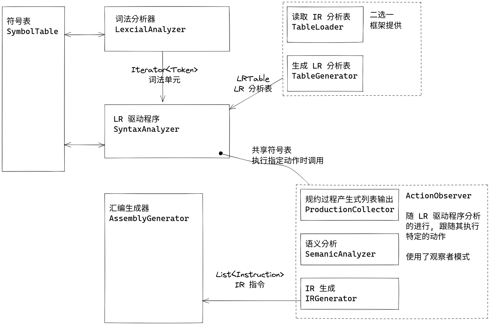

# STC (Simple TXT Compiler)

一个 Java 实现的 TXT 语言编译器, 目标平台为 RISC-V 32 (指令集 RV32M). 

## 目录说明

```bash title="tree . -L 2 --dirsfirst --sort=name"
.
├── data                
│   ├── in                  # 提供给程序的输入数据
│   ├── out                 # 程序的输出数据
│   └── std                 # 用作参考的标准输出数据
├── scripts
│   ├── check-result.py     # 对输出进行 check 的脚本
│   ├── diff.py             # 忽略文件尾空行和行首位空白符的 diff 工具
│   └── make-template.py    # 从代码出框架的脚本, 无需关注
└── src                     # 源码目录
```

```bash title="tree src/cn/edu/hitsz/compiler -L 2 --dirsfirst --sort=name"
src/cn/edu/hitsz/compiler
├── asm                             # 实验四: 汇编生成
│   └── AssemblyGenerator.java          # 汇编生成器
├── ir                              # 基础架构: IR
│   ├── Instruction.java                # IR 指令
│   ├── InstructionKind.java            # IR 指令类型
│   ├── IRImmediate.java                # IR 立即数
│   ├── IRValue.java                    # IR 值
│   └── IRVariable.java                 # IR 变量
├── lexer                           # 实验一: 词法分析
│   ├── LexicalAnalyzer.java            # 词法分析器
│   ├── Token.java                      # 词法单元
│   └── TokenKind.java                  # 词法单元类别
├── parser                          # 实验二/三: 语法分析, 语义分析, IR 生成
│   ├── table                           # 读取/生成 LR 表的工具
│   ├── ActionObserver.java             # 观察者接口
│   ├── IRGenerator.java                # IR 生成
│   ├── ProductionCollector.java        # 规约产生式记录
│   ├── SemanticAnalyzer.java           # 语义分析
│   └── SyntaxAnalyzer.java             # 语法分析
├── symtab                          # 符号表
│   ├── SourceCodeType.java             # 源语言变量类型
│   ├── SymbolTableEntry.java           # 符号表条目
│   └── SymbolTable.java                # 符号表
├── utils                           # 杂项/工具
│   ├── FilePathConfig.java             # 记录程序中用到的各种路径
│   ├── FileUtils.java                  # 文件读写工具
│   └── IREmulator.java                 # 评测用 IR 解释器
├── Main.java                       # 主函数
└── NotImplementedException.java    # 用于填充待实现部分的异常
```

### 代码架构示意图



## 源语言 

由于我们的语言代码文件后缀为 `txt`, 于是我们姑且称之为 TXT 语言. 以下为一个简单的代码示例: 

```c
int result;
int a;
int b;
int c;
a = 8;
b = 5;
c = 3 - a;
result = a * b - ( 3 + b ) * ( c - a );
return result;
```

可以看到 TXT 语言为一个类 C 的语言. 关于 TXT 语言的详细定义, 如文法等我们将在实验一中讨论. 

## 目标平台 && 目标语言  

我们的目标是生成在支持 RV32M 指令集的 RISC-V 32 机器上可以成功运行的汇编代码. 然而这份代码要成功运行还得通过汇编器和链接器生成可执行文件并链接到相应的库上. 

然而在实际操作中我们并没有一台 RISC-V 32 的机器, 就算通过 qemu 模拟, 我们仍不可避免地需要与 GNU 汇编伪指令操作打交道. 为了避免这些麻烦, 我们使用 [RARS(RISC-V Assembler and Runtime Simulator)](https://github.com/TheThirdOne/rars) 进行模拟. 可以认为我们的目标机器为 RARS.  

根据 RISC-V 的寄存器使用约定, 我们使用 Caller 保存的 t0 到 t6, 亦即 x5-7, x28-31 作为汇编代码中任意使用的寄存器, 使用 a0, 亦即 x10 作为程序的返回值. 并且我们使用 CompactDataAtZero 选项规定 data 的开始地址为 0x0. 通过 RARS 我们可以这样进行汇编程序的执行:

```shell
$ java -jar rars.jar mc CompactDataAtZero a0 nc dec ae255 riscv1.asm

Program terminated by dropping off the bottom.
a0	10945
```

## 关于 `NotImplementedException`

此异常会在期待你实现, 但是你还没有实现的函数中被抛出. 由于我们一次性下发了整个项目的代码, 所以在你完成整个实验之前, 程序都会以抛出 `NonImplementedException` 异常然后结束. 如果你完成了每次实验的要求, 那么这种结束方式是无关大雅的. 倘若你担心遗漏了某次实验中待填充的函数, 那么请你先清空 `data/out` 文件夹, 随后运行程序, 再检查一下程序运行之后在 `data/out` 中的输出情况. 只要输出的文件数量符合要求且数量/内容是正确的, 那么该实验就算是完成了.