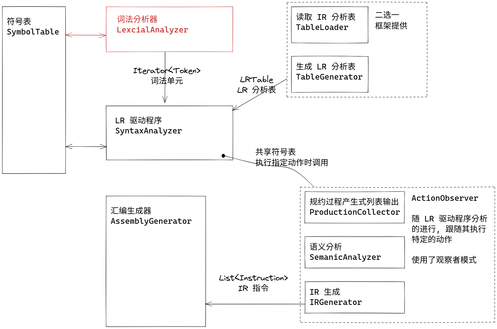

在本次实验中, 你将要使用自动机的写法实现一个简单的, 特定的词法分析器. 具体要实现的词法规则如下:

| 类别        | 正则表达式           |
|-------------|----------------------|
| `int`       | `int`                |
| `return`    | `return`             |
| `=`         | `=`                  |
| `,`         | `,`                  |
| `Semicolon` | `;`                  |
| `+`         | `+`                  |
| `-`         | `-`                  |
| `*`         | `*`                  |
| `/`         | `/`                  |
| `(`         | `(`                  |
| `)`         | `)`                  |
| `id`        | `[a-zA-Z_][a-zA-Z]*` |
| `IntConst`  | `[0-9]+`             |

每个词法单元之间可能有任意的空白字符 (`\s`, 或 `[\t\r\n ]`), 这些字符应当忽略. 

你需要根据读入的源语言的代码文本, 生成词法单元迭代器并正确地将源语言中的每个标识符插入到符号表中, **不要求** 记录每个词法单元的行号, 起始列号, 结束列号, **不要求** 处理注释.

框架中已包含词法单元 (`Token`) 以及符号表 (`SymbolTable`) 的实现. 从文件中读取内容、将生成的词法单元输出到文件中、将符号表输出到文件中的过程亦已实现.

## 输入/输出

本实验中的程序需要读入下面的文件:

```bash title="tree data/in --sort=name"
data/in
├── coding_map.csv      # 码点文件
└── input_code.txt      # 输入的代码
```

它将会生成下面的文件:

```bash title="tree data/out --sort=name"
data/out
├── old_symbol_table.txt    # 符号表
└── token.txt               # 词法单元列表
```

输出的文件内容具体是什么可以参考 `data/std` 目录下的同名文件.