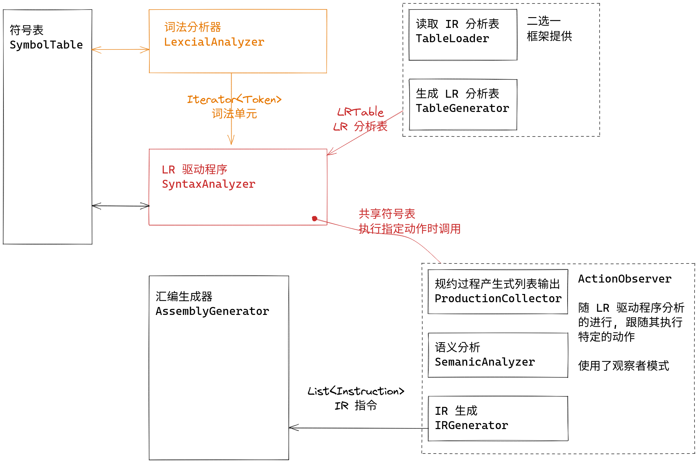
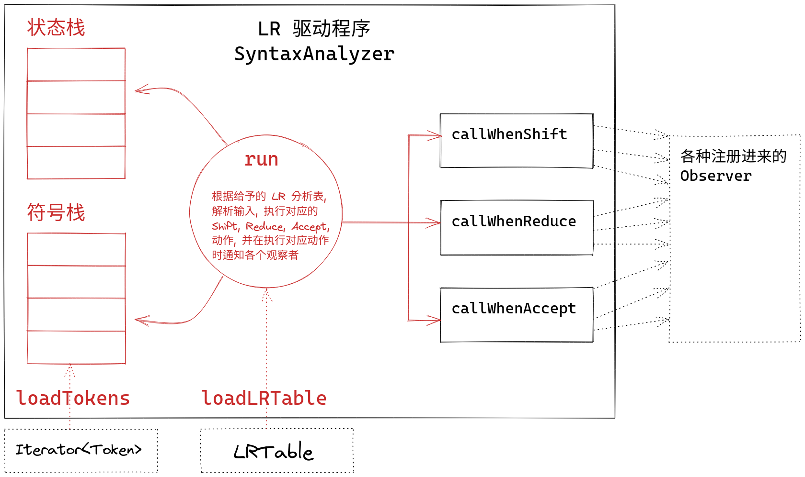

在本次实验中, 你将要实现一个通用的 LR 语法分析驱动程序. 它可以读入词法单元类别, 任意的语法以及与之匹配的任意的 LR 分析表, 随后读入词法单元流, 依次根据分析表与语法执行移入、规约、接受、报错动作, 并在前三种动作执行时调用注册到其上的观察者的对应方法. 

此驱动程序本身不会进行任何输出 -- 它仅仅时作为一个被观察者, 在动作发生时通过调用观察者特点方法, 传递信息的方式通知各观察者. 为了确定你的代码正确, 框架预先提供了一个在每次规约的时候记录规约到的产生式的观察者. 若你正确实现了本实验, 该观察者将会按规约顺序输出所有记录到的产生式.



## 输入/输出

本实验中的程序需要读入下面的文件:

```bash title="tree data/in --sort=name"
data/in
├── coding_map.csv      # 码点文件
├── grammar.txt         # 语法文件
├── input_code.txt      # 输入代码
└── LR1_table.csv       # (可选) 第三方工具生成的 IR 分析表
```

它将会生成下面的文件:

```bash title="tree data/out --sort=name"
data/out
├── parser_list.txt         # 规约过程的产生式列表
├── old_symbol_table.txt    # 语义分析前的符号表
└── token.txt               # 词法单元流
```

输出的文件内容具体是什么可以参考 `data/std` 目录下的同名文件.
