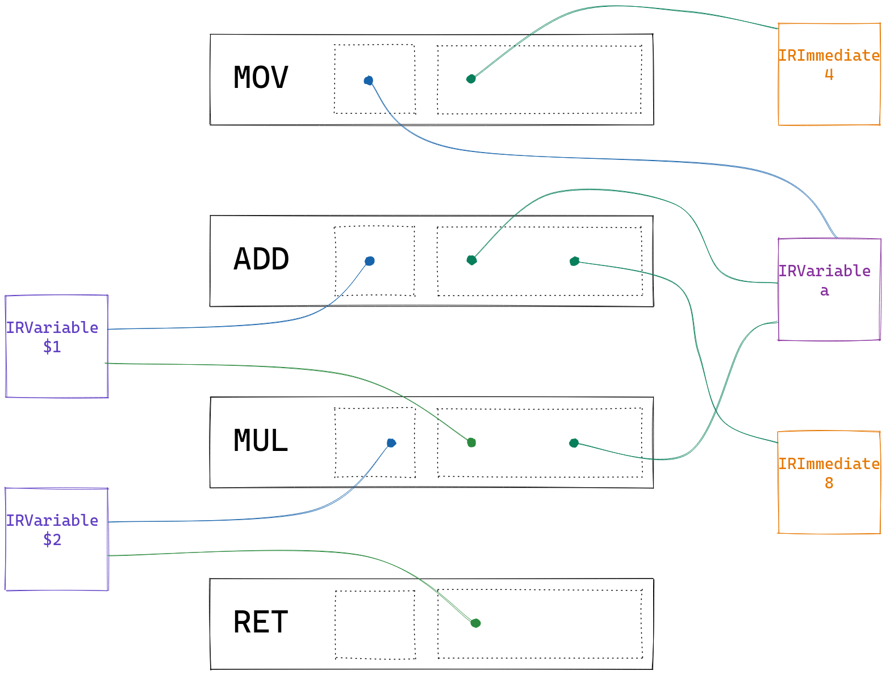
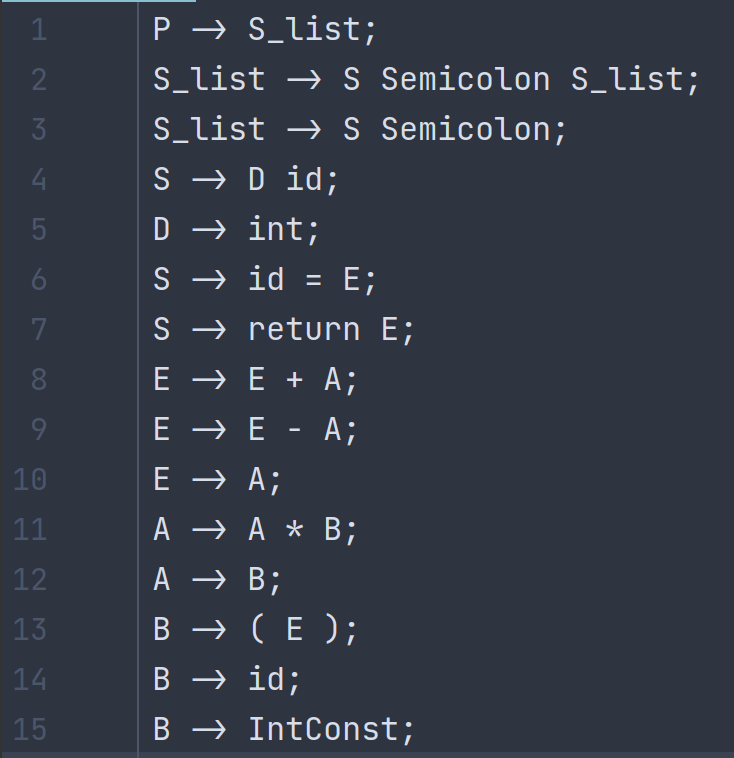

## IR 相关 API

### 总览

对 IR 而言, 重要的不是它写成怎么样 (文本表示), 而是它实现上/代码上是怎么样的 (内存中表示).

就实现而言, 我们的 IR 是指令与变量分离的三地址形式的中间表示, 各指令接受数量不定的变量作为参数, 代表执行某种动作, 如果有运算结果的话还会将结果存放于变量中. 而变量有可能被多条指令使用, 代表某种能存放信息的位置, 在指令之间传递信息与结果. 下面是一个翻译的例子:

源语言:

```c
int a;
a = 4;
return (a + 8) * a;
```

中间表示的文本表示:

```
(MOV, a, 4)
(ADD, $1, a, 8)
(MUL, $2, $1, a)
(RET, , $2)
```

中间表示的内存中形式 (逻辑图示):



### IR 中的值: `IRValue`, `IRVariable`, `IRImmediate`

我们使用 `IRValue` 代表所有能作为 IR 指令的参数的事物. 在我们当前的 IR 中, 主要有两种东西可以作为指令的参数, 分别是立即数和变量, 实现为 `IRImmidiate` 和 `IRVariable`, 分别实现如下: 

```java
interface IRValue {}

class IRImmediate implements IRValue {
    private int value;
}

class IRVariable implements IRValue {
    private String name;
}
```

其中 `IRVariable` 的 `name` 一般不要求有什么意义, 只是拿来区分各个 `IRVariable` 的罢了. 但实践上我们一般会把源代码中的一些信息也记载到 IR 上, 方便调试和观察. 所以我们允许在构造 `IRVariable` 的时候为它指定一个名字, 这样你就可以清楚地看到该 `IRVariable` 在翻译时是对应了源语言中的哪个变量. 当然你也可以完全不管, 所有变量都用默认名称了事. 

```java
class IRVariable {
    // 构造一个具有附加名称 `name` 的 IR 变量
    public static IRVariable named(String name);

    // 构造一个具有默认附加名称的 IR 变量
    public static IRVariable temp();    
}
```

### IR 中的指令: `Instruction`

IR 指令在逻辑上定义如下: 

```java
enum InstructionKind {
    MOV, ADD, SUB, MUL, RET
}

class Instruction {
    private InstructionKind kind;
    private IRVariable result;          // nullable, if instruction has no result
    private List<IRValue> operands;
}
```

关于为什么采取这种更类似 C 中 union 的实现方式而非继承, 在代码的注释中已有解释. 虽然不同类别的 IR 指令内部结构一致, 但它们显然有不同的构造方式与不同的组成部分. 具体而言:

- `MOV`, `RET` 指令只有一个参数
- `ADD`, `SUB`, `MUL` 指令有两个参数
- `RET` 指令没有结果

为了更好地构造指令与访问指令中的具体成分, 我们提供了一些辅助方法.

#### 构造

不同类别的指令对应接受不同参数的的静态构造函数:

```java
class Instruction {
    public static Instruction createMov(IRVariable result, IRValue from);
    public static Instruction createAdd(IRVariable result, IRValue lhs, IRValue rhs);
    public static Instruction createSub(IRVariable result, IRValue lhs, IRValue rhs);
    public static Instruction createMul(IRVariable result, IRValue lhs, IRValue rhs);
    public static Instruction createRet(IRValue returnValue);
}
```

#### 访问

对任意指令, 我们提供两个通用访问方法: (虽然对于 `RET` 而言, `getResult` 并不能使用)

```java
class Instruction {
    public IRVariable getResult();
    public List<IRValue> getOperands();
}
```

随后是与静态构造函数参数名称对应的域的获取方法:

```java
class Instruction {
    public IRValue getFrom();
    public IRValue getLHS();
    public IRValue getRHS();
    public IRValue getReturnValue();
}
```

当你试图访问一个对当前指令而言不存在的域的时候, 它会抛出 `RuntimeException`. 各方法允许调用的指令类别如下:

- `getResult`: `MOV`, `ADD`, `SUB`, `MUL`
- `getFrom`: `MOV`
- `getLHS`, `getRHS`: `ADD`, `SUB`, `MUL`
- `getReturnValue`: `RET`

或者反查表:

- `MOV`: `getResult`, `getFrom`
- `ADD`, `SUB`, `MUL`: `getResult`, `getLHS`, `getRHS`
- `RET`: `getReturnValue`

## 语法文件相关 API

### `Production`: 产生式

一个产生式由下面的三部份组成:

```java
class Production {
    // 用来唯一标识该产生式的索引
    private int index;
    // 产生式头
    private NonTerminal head;
    // 产生式体
    private List<Term> body;
}
```

比如说对于产生式 `S -> D id` 而言, 其 `head` 即为非终结符 `D`, `body` 即为 `List.of(非终结符 D, 终结符 id)`. 而产生式索引则保证为其在 `grammar.txt` 中的行号, 从 1 开始. 

如下图, 当你使用任何支持显示行号的软件打开 `grammar.txt` 时, 你就能方便地确定每条产生式的 `index`:



此时 `P -> S_list` 的 `index` 便是 `1`, `S -> D id` 的 `index` 便是 `4`, 如此类推.

`index` 的存在主要是为了方便在 `ActionObserver#whenReduce` 方法中根据规约到的产生式进行不同的动作, 你可以参考下面的写法:

```java
class ThisIsAClass implements ActionObserver {
    @Override
    public void whenReduce(Status currentStatus, Production production) {
        switch (production.index()) {
            // 我们推荐在 case 后面使用注释标明产生式
            // 这样能比较清楚地看出产生式索引与产生式的对应关系
            case 1 -> { // P -> S_list
                /* ... */
            }

            case 4 -> { // S -> D id 
                /* ... */
            }

            case 5 -> { // D -> int
                /* ... */
            }
            // ...
            default -> { // 
                // throw new RuntimeException("Unknown production index");
                // 或者任何默认行为
            }
        }
    }
}
```

#### `Term`, `NonTerminal`, `TokenKind`: 各类文法符号

`Term` 代表一个文法符号, 可以是终止符也可以是非终止符. `name` 被设计为用于表示这个文法符号的名字, 比如对于非终结符 `P`, 它的 `name` 就是 `"P"`. 

```java
abstract class Term {
    private String name;
}
```

非终结符的实现非常简单: 它什么都不用存, 只需要有一个构造函数即可.

```java
class NonTerminal extends Term {}
```

终止符直接使用了 `TokenKind`:

```java
class TokenKind extends Term {}
```