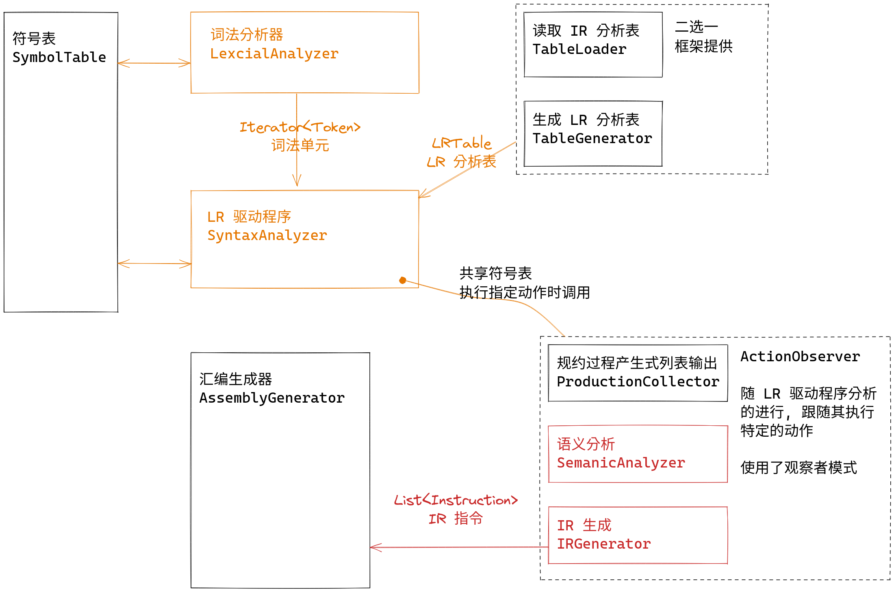

在本次实验中, 你将要完成 SDT 风格的语义分析与 IR 生成.

这两个过程作为观察者被注册到语法分析器中, 其特定方法在语法分析执行特定动作时被调用, 同时获得动作的相关信息. 在语义分析中, 你需要在遇到每次声明的时候, 于符号表中记录每个标识符的类型信息. 在 IR 生成中, 你需要在遇到不同语法产生式时执行不同动作, 产生 IR (中间表示) 指令列表.

中间表示的代码实现已为你写好.

## 输入/输出

本实验中的程序需要读入下面的文件:

```bash title="tree data/in --sort=name"
data/in
├── coding_map.csv      # 码点文件
├── grammar.txt         # 语法文件
├── input_code.txt      # 输入代码
└── LR1_table.csv       # (可选) 第三方工具生成的 IR 分析表
```

它将会生成下面的文件:

```bash title="tree data/out --sort=name"
data/out
├── intermediate_code.txt   # 中间表示
├── ir_emulate_result.txt   # 中间表示的模拟执行的结果
├── parser_list.txt         # 规约过程的产生式列表
├── new_symbol_table.txt    # 语义分析后的符号表
├── old_symbol_table.txt    # 语义分析前的符号表
└── token.txt               # 词法单元流
```

输出的文件内容具体是什么可以参考 `data/std` 目录下的同名文件.