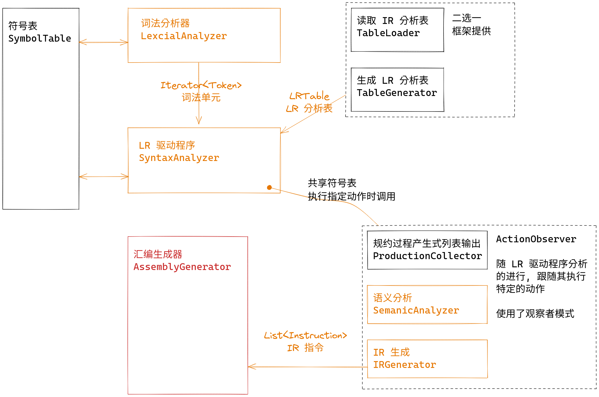

在本次实验中, 你将要完成汇编代码生成与寄存器分配. 目标平台为支持 RV32M 的 riscv32 机器. 

!!! note "说明"
    本实验中所有的 "选做" 都无额外加分. 

## 所需的 RV32M 指令

!!! info "参考"
    - [riscv-book](http://riscvbook.com/chinese/RISC-V-Reader-Chinese-v2p1.pdf)
        - [RV32I](http://riscvbook.com/chinese/RISC-V-Reader-Chinese-v2p1.pdf#%5B%7B%22num%22%3A77%2C%22gen%22%3A0%7D%2C%7B%22name%22%3A%22XYZ%22%7D%2C115%2C769%2C0%5D)
        - [RV32M](http://riscvbook.com/chinese/RISC-V-Reader-Chinese-v2p1.pdf#%5B%7B%22num%22%3A127%2C%22gen%22%3A0%7D%2C%7B%22name%22%3A%22XYZ%22%7D%2C115%2C769%2C0%5D)

RV32M 向 RV32I 添加了整数乘法和整数除法的指令. 

| 指令                  | 含义       |
|-----------------------|------------|
| `add rd, rs1, rs2`    | 寄存器加法 |
| `sub rd, rs1, rs2`    | 寄存器减法 |
| `mul rd, rs1, rs2`    | 寄存器乘法 |
| `addi rd, rs1, imm`   | 立即数加法 |
| `subi rd, rs1, imm`   | 立即数减法 |
| `lw rd, offset(rs1)`  | 内存读     |
| `sw rs2, offset(rs1)` | 内存写     |

??? note "不作要求的选做"
    在 CPU 设计中我们实现了一个支持除了寄存器乘法以外上述所有指令的 CPU, 可以通过使用其它方式实现乘法使得我们的编译器编译出的汇编代码稍加改造, 经过汇编器后使得程序在 CPU 上运行. 

同时有一些可能会用到的伪指令. 

| 伪指令       | 含义             |
|--------------|------------------|
| `mv rd, rs`  | `addi rd, rs, 0` |
| `neg rd, rs` | `sub rd, x0, rs` |
| `li rd, imm` | 加载立即数         |

## 寄存器约定

根据 [RISC-V 的函数调用规范](http://riscvbook.com/chinese/RISC-V-Reader-Chinese-v2p1.pdf#%5B%7B%22num%22%3A107%2C%22gen%22%3A0%7D%2C%7B%22name%22%3A%22XYZ%22%7D%2C115%2C225%2C0%5D), 我们在代码生成时 **只** 使用 Caller 保存的 t0 到 t6, 亦即 x5-7, x28-31 作为汇编代码中任意使用的寄存器, 使用 a0, 亦即 x10 作为程序的返回值. 并且我们使用 CompactDataAtZero 选项规定 data 的开始地址为 0x0. 

通过 RARS 我们可以这样进行汇编程序的执行并以十进制形式输出 a0 的值:

```shell
$ java -jar rars.jar mc CompactDataAtZero a0 nc dec ae255 riscv1.asm

Program terminated by dropping off the bottom.
a0	10945
```

在程序执行后的 a0 值应为返回值. 

## 输入/输出

本实验中的程序需要读入下面的文件:

```bash title="tree data/in --sort=name"
data/in
├── coding_map.csv      # 码点文件
├── grammar.txt         # 语法文件
├── input_code.txt      # 输入代码
├── LR1_table.csv       # (可选) 第三方工具生成的 IR 分析表
└── reg-alloc.txt       # (可选) 用于测试寄存器分配的样例
```

它将会生成下面的文件:

```bash title="tree data/out --sort=name"
data/out
├── assembly_language.asm   # 汇编代码
├── intermediate_code.txt   # 中间表示
├── ir_emulate_result.txt   # 中间表示的模拟执行的结果
├── parser_list.txt         # 规约过程的产生式列表
├── new_symbol_table.txt    # 语义分析后的符号表
├── old_symbol_table.txt    # 语义分析前的符号表
└── token.txt               # 词法单元流
```

输出的文件内容具体是什么可以参考 `data/std` 目录下的同名文件.

当你实现完这个实验之后, 你的程序应该不会再抛出任何的 `NonImplementedException` 了.